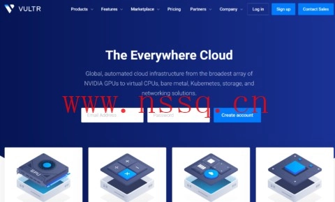

# Vultr 新用户福利：最高送 300 美元，全球 32 个机房随便挑

---

如果你正在找一个价格亲民、机房选择多、按小时计费的云服务器，Vultr 这波新用户活动可能正合你意。无论是搭个梯子、部署网站，还是跑点测试项目，这家 2014 年成立的老牌商家提供的 KVM 架构云服务器确实够灵活——支持 Windows 和 Linux 系统，还能自定义 ISO 安装。最关键的是，他们现在针对新用户送钱，最高能拿 300 美元。

---

## 活动一：注册就送 300 美元（但有时间限制）

新用户通过活动链接注册后，用 PayPal 或信用卡激活账户，系统会直接往你账户里打 300 美元。听起来很美好，但有个坑：**这笔钱有效期只有 30 天**。也就是说，如果你一个月内没用完，剩下的就自动作废了。

所以这个活动适合那种"我马上就要用云服务器，而且用量不小"的场景。如果你只是想随便试试，可能不太划算。

---

## 活动二：充值送同等金额（最高 100 送 100）

如果你不想被 30 天有效期逼着用，可以选择另一种方式：充多少送多少。最低充 10 美元送 10 美元，最高充 100 美元送 100 美元。这个赠送金额的有效期是 **12 个月**，比第一种活动宽裕多了。

👉 [如果你需要一个稳定好用的云服务器平台，Vultr 的按需付费模式和全球机房覆盖非常适合各种项目部署需求](https://www.vultr.com/?ref=9738262-9J)

充值时记得在页面输入优惠码：**VULTRMATCH**。消费的时候，系统会按照充值金额和赠送金额各扣一半。比如你花 10 美元，实际扣你充值的 5 美元加赠金 5 美元。

---

## 这两个活动只能选一个

注意，**新用户只能二选一**——要么激活送 300 美元，要么充值送等额金额，不能两个都要。除了上面这两个主要活动，Vultr 还有一些其他版本的赠送活动，比如注册送 100 美元（14 天有效）或者用优惠码 **FLYVULTR250** 送 250 美元（30 天有效）。如果上面那俩过期了，可以试试这些备选方案。

另外，这些福利都是针对新注册用户的。如果你想注册多个账户薅羊毛，记得避免信息关联，否则可能被系统识别出来。

---

## Vultr 的云服务器到底怎么样

Vultr 提供的云服务器基于 KVM 架构，产品线分为 Cloud Compute、Optimized Cloud Compute、Cloud GPU、Bare Metal 等多个系列。根据 CPU 和磁盘类型，又细分为 AMD High Performance、Intel High Performance、High Frequency、Regular Cloud Compute 等配置。

价格方面，最便宜的 Cloud Compute-Shared CPU（Regular Cloud Compute 系列）部分机房低至每月 2.5 美元（$0.004/小时，仅 IPv6）。如果需要 IPv4，套餐最低从 $3.5/月起步。

机房选择是 Vultr 的一大优势。他们在全球 32 个国家或地区有数据中心，包括：
- **亚洲**：日本、新加坡
- **美国**：洛杉矶、西雅图、达拉斯等
- **欧洲**：德国等
- **其他**：澳大利亚等冷门地区

无论你是想搭个低延迟的日本 VPS，还是找个便宜的美国洛杉矶或西雅图机房，基本都能覆盖到。

---

## 按小时计费：用多少花多少

Vultr 采用按小时计费模式，这意味着你不需要的时候可以直接销毁实例，不会继续扣费。注意，这里说的是**销毁**，不是关机——关机状态下依然会扣费。

这种计费方式特别适合那些临时需要服务器的场景，比如跑个短期测试、部署个临时项目什么的。用完就删，不浪费一分钱。

👉 [对于需要灵活部署、全球覆盖的用户来说，Vultr 的按需付费和丰富机房选择能大大降低成本和管理难度](https://www.vultr.com/?ref=9738262-9J)

---

## 支付方式

Vultr 支持信用卡、PayPal 和支付宝付款，对国内用户比较友好。

---

## 总结

如果你正好需要一个云服务器，Vultr 这波新用户活动确实值得试试。送 300 美元那个适合"马上要大量使用"的场景，充值送等额适合"长期稳定使用"的需求。机房多、价格透明、按需付费，基本能覆盖大部分使用场景。记得选对活动，避免浪费赠金。
